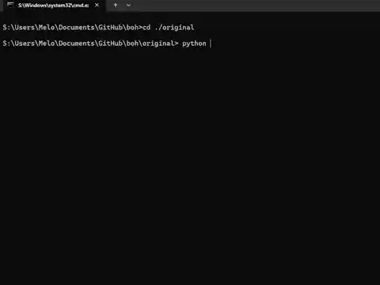
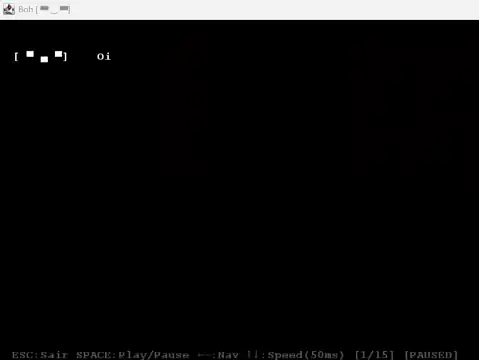
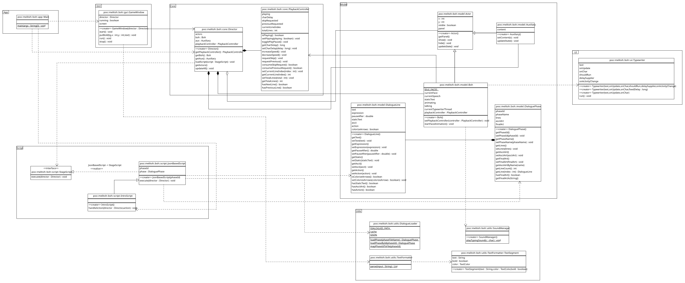

# Implementação do Boh em Java pra cadeira de POO

Tentando explicar de forma simples, o Boh era um script Python básico projetado durante a cadeira de Estrutura de Dados pra ajudar a visualizar o processo de inversão de uma lista encadeada. Sendo "Boh" o nome do personagem principal com quem o usuário interage e "conversa" durante o desenrolar da [tentativa de] visualização do funcionamento do algoritmo. Vale a pena ressaltar que não foi realizada a implementação completa do código original, só o __suficiente para cumprir os requisitos__ exigidos no trabalho final. Então, é possível executar o programa e visualizar parte do conteúdo original.

## Objetivo

Ainda que o script Python possa ser acessado na pasta [```original```](./original/) presente nesse repositório; o objetivo desse projeto é reimplementar o Boh em Java, reescrevendo e melhorando suas funcionalidades pro paradigma orientado a objetos - já que ele era majoritariamente procedural - enquanto mantendo a essência e a finalidade do script original: __Ensinar de uma maneira simples e descontraída sobre a inversão de uma lista encadeada__. O que, como era de se esperar, acabou se mostrando um objetivo um pouco ambicioso demais.

## Apresentação

$${Segue \space em \space anexo \space o \space vídeo \space para \space apresentação \space do \space projeto:}$$

<!-- markdownlint-disable-next-line -->
[](https://www.youtube.com/watch?v=frEHPstMQ-0)

O arquivo do vídeo acima pode ser encontrado para download [aqui](./docs/video-poo.mp4).

## Instruções

Para executar a versão mais recente do projeto Java, certifique-se de ter o JRE/JDK 21+ (ou superior) instalado, baixe/clone o projeto na sua máquina ou simplesmente realize o download do executável em [___Releases___](https://github.com/araujosemacento/boh/releases) e execute o comando a seguir na pasta-raiz, onde o executável se encontra:

```bash
java -jar .\boh-1.0-release.jar
```

### Troubleshooting

Durante todo o percurso do desenvolvimento, o projeto foi compilado e executado com a versão 21.0.8 do [Temurin® JDK](https://adoptium.net/pt-BR/temurin/releases?version=21), sendo portanto recomendado que seja utilizado caso hajam erros de compatibilidade na execução do pacote.

$${\color{red}No \space Windows \space é \space necessário \space utilizar \space o \space binário \space javaw!}$$

Caso se dê de cara com um problema na execução do comando com o binário ```java``` no Windows, é porque a dependência ```Lanterna``` foi utilizada no projeto. Essa biblioteca inicia uma instância __Swing__ e para isso utiliza o binário ```javaw``` para ser executada sem uma janela de terminal/prompt de comando. Pra sanar esse comportamento, utilize o comando a seguir ao invés daquele exibido anteriormente:

```bash
javaw -jar .\boh-1.0-release.jar
```

### Compilação

Caso queira compilar o projeto a partir do código-fonte no seu computador, certifique-se de ter além do JDK correto, como indicado em [Troubleshooting](./README.md#troubleshooting), garantir que a ferramenta de gerenciamento de projetos [Apache Maven](https://maven.apache.org/install.html) esteja devidamente instalada na máquina (é recomendado o uso de ```winget``` em computadores ___Windows___). Com ela devidamente configurada para suporte à versão de modelo ```4.0.0``` e compilador maven versão ```21```, como definido no arquivo [pom.xml](./pom.xml)... Depois, basta navegar até a pasta-raiz do projeto e executar o comando:

```bash
mvn clean package
```

O executável ```.jar``` vai ser gerado na pasta ```target``` entregando um arquivo virtualmente idêntico ao disponibilizado em [Releases](https://github.com/araujosemacento/boh/releases) nomeado como ```boh-1.0-jar-with-dependencies.jar```. Para executá-lo, utilize o mesmo comando exibido em [Instruções](./README.md#instruções), substituindo o nome do arquivo conforme necessário:

```bash
java -jar .\target\boh-1.0-jar-with-dependencies.jar
```

Ou, em um ambiente Windows:

```bash
javaw -jar .\target\boh-1.0-jar-with-dependencies.jar
```

## Comparação

A seguir, incluímos uma "matriz comparativa" entre as funcionalidades do script original em Python e o que foi portado ou adaptado para a versão em Java:

| Recurso | Original (`Boh.py`) | Projeto Java | Status |
| :--- | :--- | :--- | :--- |
| __Dependências__ | Verificação dinâmica e instalação via `pip` | Incluídas em empacotamento estático | Melhorado |
| __Interface (UI)__ | Terminal do Sistema (`blessed` + ANSI) | Terminal Emulado Swing (`Lanterna`) + Threading | Melhorado |
| __Áudio (SFX)__ | Interação sonora dinâmica (`pygame`) | Não implementado | Ausente (a ser implementado) |
| __Animações__ | Efeito de "datilografia" e expressões faciais apresentavam _flickering_ | Renderização de texto em componentes de forma concomitante | Melhorado |
| __Visualização__ | _Strings_ e ASCII Art _hardcoded_ no script | Objetos renderizáveis baseados em classes | Estruturado (a ser aprimorado) |
| __Interatividade__ | Input em tempo real com _timeout_ e reações | Input síncrono padrão | Simplificado |
| __Playback/Reprodução__ | Loops simples com delays e timeout. Apenas _```play/pause```_ | Play, pause, acelerar/desacelerar velocidade de diálogo, pular para fala seguinte ou anterior | Melhorado |
| __Povoamento__ | Boh, Aux e Lista com diálogo completo | Apenas introdução de Boh | Estruturado (a ser aprimorado) |



Enquanto o projeto original priorizava a experiência imersiva (áudio, timing, animações), o novo projeto tenta focar na robustez da arquitetura. Funcionalidades mais complexas de Input/Output em tempo real e áudio foram abstraídas pra dar espaço a uma estrutura de classes que busca representar o domínio do problema, pra garantir que o programa rode visualmente idêntico em qualquer sistema operacional com a janela Swing.



## Diagrama de Classes

$${Segue \space em \space anexo \space o \space diagrama \space de \space classes \space do \space projeto:}$$

<!-- markdownlint-disable-next-line -->
<a href="./docs/DiagramadeClasses.svg"></a>

### Estrutura

O projeto foi organizado em pacotes que refletem as seguintes responsabilidades:

1. __`poo.melitoh.boh.app`__
   Ponto de entrada da aplicação, contendo a classe `Main` que inicializa o `Director` e a `GameWindow`.
2. __`poo.melitoh.boh.core`__
   Núcleo lógico do sistema, incluindo o `Director` pra gestão de estado e o `PlaybackController` pra controle do fluxo de tempo das falas.
3. __`poo.melitoh.boh.model`__
   Define as entidades da conversa (`Boh`, `Auxiliary`) e estruturas de dados dos diálogos (`DialoguePhase`, `DialogueLine`).
4. __`poo.melitoh.boh.gui`__
   Gerencia a interface visual utilizando a biblioteca `Lanterna`, isolando a renderização na `GameWindow`.
5. __`poo.melitoh.boh.script`__
   Lógica de "roteamento" das cenas, com classes base e implementações concretas como `IntroScript`.
6. __`poo.melitoh.boh.utils`__
   Fornece as classes de uso utilitário como `DialogueLoader` para carregar JSONs e `TextFormatter` para processar estilos.
7. __`poo.melitoh.boh.ui`__
   Implementa componentes de interface específicos, como a animação de `Typewriter` no texto.

<!-- markdownlint-disable-next-line -->
#### Relacionamento entre as Classes que chegaram a ser implementadas e os requisitos do trabalho final:

| Nº | Classes implementadas | Herança | Associação | Abstrata/Interface | Polimorfismo | Modificador de acesso | Estático |
| :--- | :--- | :---: | :---: | :---: | :---: | :---: | :--- |
| 1 | `Main` | ${\color{red}✗}$ | ${\color{green}✓}$ | ${\color{red}✗}$ | ${\color{red}✗}$ | ${\color{blue}+}$ | ~~`main()`~~ |
| 2 | `Director` | ${\color{red}✗}$ | ${\color{green}✓}$ | ${\color{red}✗}$ | ${\color{red}✗}$ | ${\color{orange}-}$ ${\color{blue}+}$ | ${\color{red}✗}$ |
| 3 | `PlaybackController` | ${\color{red}✗}$ | ${\color{red}✗}$ | ${\color{red}✗}$ | ${\color{red}✗}$ | ${\color{orange}-}$ ${\color{blue}+}$ | ${\color{red}✗}$ |
| 4 | `GameWindow` | ${\color{green}✓}$ | ${\color{green}✓}$ | ${\color{red}✗}$ | ${\color{green}✓}$ | ${\color{orange}-}$ ${\color{blue}+}$ | ${\color{red}✗}$ |
| 5 | `Actor` | ${\color{red}✗}$ | ${\color{green}✓}$ | ${\color{green}✓}$ | ${\color{red}✗}$ | ${\color{#60a}\\#}$ ${\color{blue}+}$ | ${\color{red}✗}$ |
| 6 | `Boh` | ${\color{green}✓}$ | ${\color{green}✓}$ | ${\color{red}✗}$ | ${\color{green}✓}$ | ${\color{orange}-}$ ${\color{blue}+}$ | `IDLE_FACES` |
| 7 | `Auxiliary` | ${\color{green}✓}$ | ${\color{green}✓}$ | ${\color{red}✗}$ | ${\color{green}✓}$ | ${\color{orange}-}$ ${\color{blue}+}$ | ${\color{red}✗}$ |
| 8 | `DialogueLine` | ${\color{red}✗}$ | ${\color{red}✗}$ | ${\color{red}✗}$ | ${\color{red}✗}$ | ${\color{orange}-}$ ${\color{blue}+}$ | ${\color{red}✗}$ |
| 9 | `DialoguePhase` | ${\color{red}✗}$ | ${\color{green}✓}$ | ${\color{red}✗}$ | ${\color{red}✗}$ | ${\color{orange}-}$ ${\color{blue}+}$ | ${\color{red}✗}$ |
| 10 | `StageScript` | ${\color{red}✗}$ | ${\color{red}✗}$ | ${\color{green}✓}$ | ${\color{red}✗}$ | ${\color{blue}+}$ | ${\color{red}✗}$ |
| 11 | `JsonBasedScript` | ${\color{green}✓}$ | ${\color{green}✓}$ | ${\color{red}✗}$ | ${\color{green}✓}$ | ${\color{#60a}\\#}$ ${\color{blue}+}$ | ${\color{red}✗}$ |
| 12 | `IntroScript` | ${\color{green}✓}$ | ${\color{red}✗}$ | ${\color{red}✗}$ | ${\color{green}✓}$ | ${\color{blue}+}$ | ${\color{red}✗}$ |
| 13 | `DialogueLoader` | ${\color{red}✗}$ | ${\color{green}✓}$ | ${\color{red}✗}$ | ${\color{red}✗}$ | ${\color{orange}-}$ ${\color{blue}+}$ | `DIALOGUES_PATH`, `cache`, `loadPhases()`, `clearCache()`... |
| 14 | `TextFormatter` | ${\color{red}✗}$ | ${\color{red}✗}$ | ${\color{red}✗}$ | ${\color{red}✗}$ | ${\color{blue}+}$ | `parse()` |
| 15 | `Typewriter` | ${\color{green}✓}$ | ${\color{green}✓}$ | ${\color{red}✗}$ | ${\color{green}✓}$ | ${\color{orange}-}$ ${\color{blue}+}$ | ${\color{red}✗}$ |

## Equipe

* __Emilly Barbosa de Lima - 540576__
* __Gabriel Melo Araujo - 536093__
